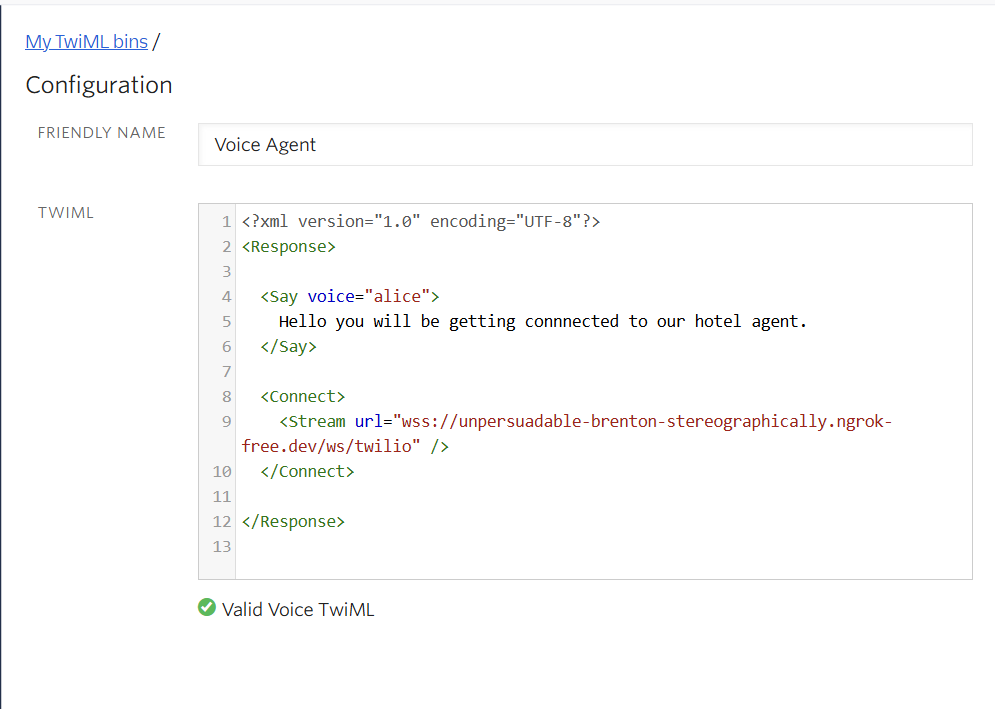

## Real-Time Voice Agent for Hotel Bookings

A streaming voice agent built with FastAPI, Deepgram, Groq LLMs, and Twilio that handles hotel inquiries and reservations with sub-1-second response times and natural interruption handling.

## Architecture


## Features

- **Real-time streaming**: STT → LLM → TTS pipeline with no bottlenecks
- **Sub-1s latency**: Consistent response times under 1 second
- **Natural interruptions**: Stops talking when interrupted
- **Function calling**: Check availability and make bookings using LLM tool calls (mock data )
- **Persistent connections**: Optimized TTS WebSocket for 50-100ms savings per chunk

## Tech Stack

- **Backend**: Python, FastAPI, AsyncIO
- **LLM**: Groq (llama-3.3-70b-versatile) - 500-800 tokens/sec
- **STT**: Deepgram Nova-2 with VAD events
- **TTS**: Deepgram Aura (aura-asteria-en)
- **Telephony**: Twilio Media Streams
- **Audio**: μ-law encoding at 8kHz, 160-byte frames

## Prerequisites

- Python 3.10 or higher
- A Twilio account (free tier works)
- Deepgram API key
- Groq API key
- ngrok (for local development)

## Setup Instructions

### 1. Clone and Setup Python Environment

```bash
# Navigate to project directory
cd "order Agent"

# Create virtual environment
python -m venv .venv

# Activate virtual environment
# On Windows:
.venv\Scripts\activate
# On Mac/Linux:
source .venv/bin/activate

# Install dependencies
pip install -r requirements.txt
```

### 2. Configure Environment Variables

Create a `.env` file in the project root:

```env
    DEEPGRAM_API_KEY=your-key
    OPENAI_API_KEY=your-key
    OPENAI_BASE_URL=https://api.groq.com/openai/v1
    LLM_MODEL=llama-3.3-70b-versatile
    VOICE_MODEL=aura-asteria-en
```

**Get your API keys:**
- **Deepgram**: Sign up at https://deepgram.com/ (free $200 credit)
- **Groq**: Sign up at https://console.groq.com/ (free tier available)
- **Twilio**: See step 3 below

### 3. Twilio Setup

#### 3.1 Create Twilio Account

1. Go to https://www.twilio.com/try-twilio
2. Sign up for a free account (you get $15 credit)
3. Verify your email and phone number

#### 3.2 Buy a Phone Number

1. In Twilio Console, go to **Phone Numbers** → **Manage** → **Buy a number**
2. Select your country
3. Check **Voice** capability
4. Click **Search** and pick any number
5. Click **Buy** (uses your free credit)
6. Note down your new phone number

#### 3.3 Create TwiML Bin

1. In Twilio Console, go to **Studio** → **TwiML Bins**
2. Click **Create new TwiML Bin**
3. Give it a friendly name: `Hotel Agent Stream`
4. Paste this XML content:

```xml
<?xml version="1.0" encoding="UTF-8"?>
<Response>
  <Say voice="alice">
    Hello, you will be getting connected to our hotel agent.
  </Say>
  <Connect>
    <Stream url="wss://YOUR-NGROK-URL/ws/twilio" />
  </Connect>
</Response>
```

**Note**: Replace `YOUR-NGROK-URL` with your actual ngrok URL (we'll get this in step 5)

5. Click **Create**
6. Keep this page open - you'll need to update the URL later



#### 3.5 Configure Your Phone Number

1. Go to **Phone Numbers** → **Manage** → **Active numbers**
2. Click on your purchased number
3. Scroll down to **Voice Configuration**
4. Under **A CALL COMES IN**, select:
   - Configure with: **TwiML Bin**
   - TwiML Bin: Select `Hotel Agent Stream` (the one you just created)
5. Click **Save configuration**


### 4. Install ngrok

ngrok creates a secure tunnel to expose your local server to the internet.

**Download and install:**
- Windows/Mac/Linux: https://ngrok.com/download
- Or via package manager:
  ```bash
  # Windows (Chocolatey)
  choco install ngrok
  
  # Mac (Homebrew)
  brew install ngrok
  
  # Linux (Snap)
  snap install ngrok
  ```

**Sign up and authenticate:**
1. Create a free account at https://dashboard.ngrok.com/signup
2. Get your authtoken from https://dashboard.ngrok.com/get-started/your-authtoken
3. Run: `ngrok config add-authtoken YOUR_AUTH_TOKEN`

### 5. Start the Application

#### 5.1 Start the FastAPI server

Open a terminal and run:

```bash
# Make sure venv is activated
.venv\Scripts\activate

# Start uvicorn server
uvicorn app.main:app --host 0.0.0.0 --port 8000 --reload
```

You should see:
```
INFO:     Uvicorn running on http://0.0.0.0:8000 (Press CTRL+C to quit)
INFO:     Started reloader process
```

#### 5.2 Start ngrok tunnel

Open a **new terminal** and run:

```bash
ngrok http 8000
```

You should see output like:
```
Forwarding    https://abc123def456.ngrok-free.app -> http://localhost:8000
```

**Copy the `https://` URL** (e.g., `https://abc123def456.ngrok-free.app`)

#### 5.3 Update TwiML Bin

1. Go back to your TwiML Bin in Twilio Console
2. Replace `YOUR-NGROK-URL` with your ngrok URL (without `https://`)
3. Final XML should look like:

```xml
<?xml version="1.0" encoding="UTF-8"?>
<Response>
  <Say voice="alice">
    Hello, you will be getting connected to our hotel agent.
  </Say>
  <Connect>
    <Stream url="wss://abc123def456.ngrok-free.app/ws/twilio" />
  </Connect>
</Response>
```

4. Click **Save**

### 6. Test Your Voice Agent

1. Call your Twilio phone number from your mobile
2. You'll hear: "Hello, you will be getting connected to our hotel agent"
3. Then you'll hear Alisha's greeting
4. Start talking! Try:
   - "I want to book a room for two people"
   - "What are your prices?"
   - "I need a room for five guests"
5. Try interrupting the agent mid-sentence - it should stop and respond to your interruption naturally

